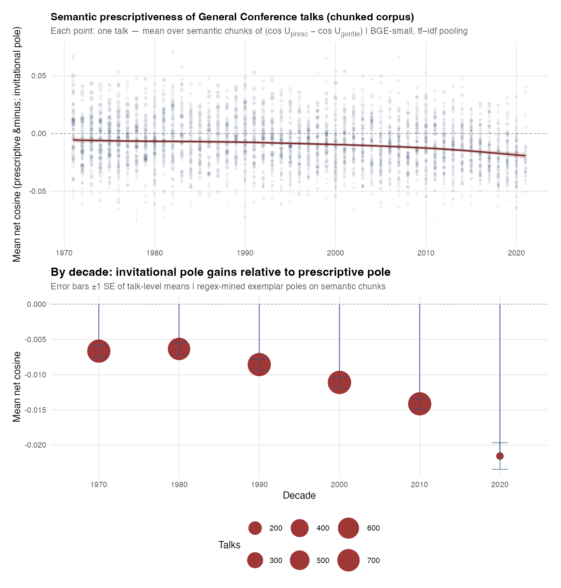
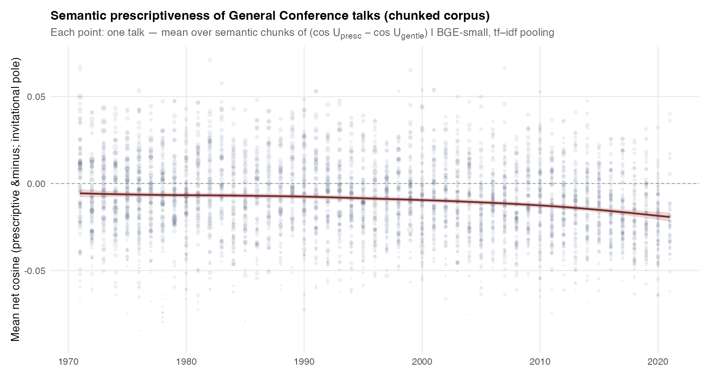
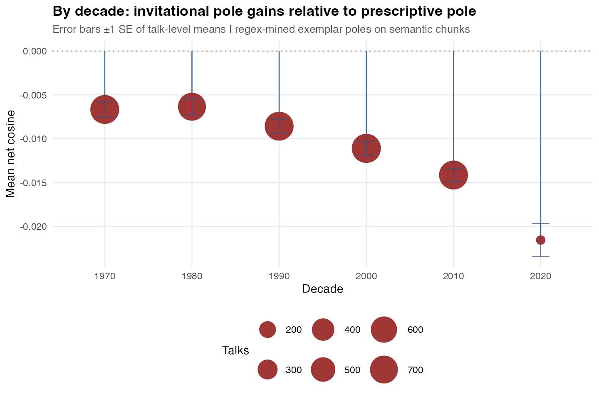
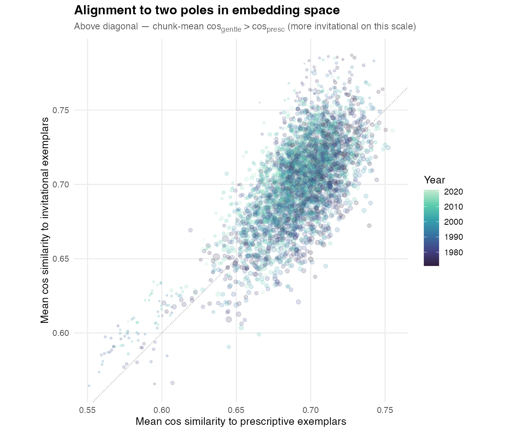
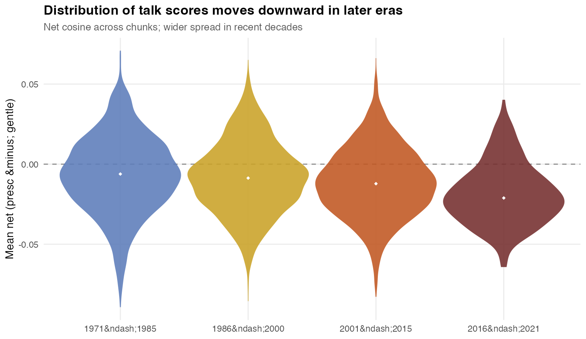

# conference-stats

Statistics and semantic analysis of LDS General Conference talks. The default bundled corpus is **1971–2021**, from the R package [**generalconference**](https://github.com/bryanwhiting/generalconference) (`genconf`), via `gc_chunk_embed_pipeline.py`.

## Documentation

| Doc | Contents |
|-----|----------|
| [`documentation/shiny-family-explorer.md`](documentation/shiny-family-explorer.md) | Shiny app, rebuilding data, sharing the HTML handout on mobile |
| [`documentation/methods-and-statistical-inference.md`](documentation/methods-and-statistical-inference.md) | Embeddings, scores, OLS/GAM, *p*-values, limits of interpretation |
| [`analysis/shiny_gc_family/HOW_TO_RUN.md`](analysis/shiny_gc_family/HOW_TO_RUN.md) | Install packages and run the app |

Standalone HTML (no R): [`documentation/shiny-family-explorer.html`](documentation/shiny-family-explorer.html) — or [preview on `main`](https://htmlpreview.github.io/?https://raw.githubusercontent.com/AdrielC/conference-stats/main/documentation/shiny-family-explorer.html).

## Pipelines (high level)

1. **Talk Parquet** — From R: `analysis/export_gc_talks_parquet.R`. From any source: build JSONL with `year` + `text` (and optional metadata), then `analysis/python/jsonl_to_talks_parquet.py` → `.parquet` with `talk_id`, `year`, `text`.
2. **Chunk + embed** — `analysis/python/gc_chunk_embed_pipeline.py --input … --output-dir …`
3. **Figures + Shiny `data/`** — `Rscript analysis/plot_gc_chunk_embed_results.R` (copies PNGs, RDS/JSON, and when present `chunks_scored.parquet`, `talk_emb_sums`, `subword_idf`, `pipeline_meta.json`).

**Custom pole / two-phrase contrast** in Shiny need Python plus the synced embedding sidecars; see `HOW_TO_RUN.md`. **Phrase-aligned exemplar** quotes need `chunks_scored.parquet` in `analysis/shiny_gc_family/data/` and Python (calls `best_contrast_chunks.py`); otherwise the app falls back to bundled **Chunk insights** swing highlights.

## Main figures (embedding pipeline)

Plots are generated after the Python pipeline runs, then synced into `analysis/shiny_gc_family/www/`.

### Trajectory and decadal summary

### Every talk vs year (GAM smooth)

### Decadal means

### Prescriptive vs invitational cosine plane

### Distributions by era

## Related outputs

- `analysis/output/prophet_prescriptive_trend.png` — optional figure from `analysis/prophet_prescriptive_nlp.R` when run.
- Interactive app: `analysis/shiny_gc_family/` (`chunk_highlights.rds` in-repo; optional pipeline files are gitignored — see `.gitignore`).
